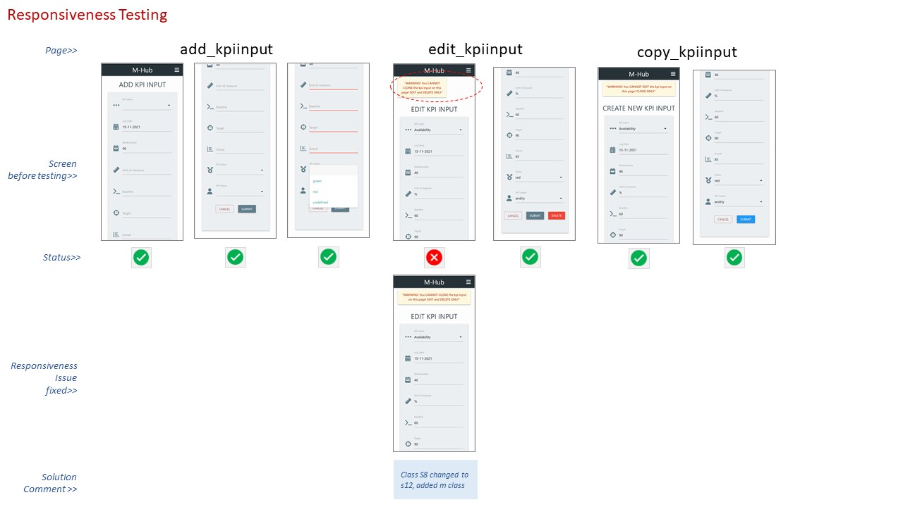
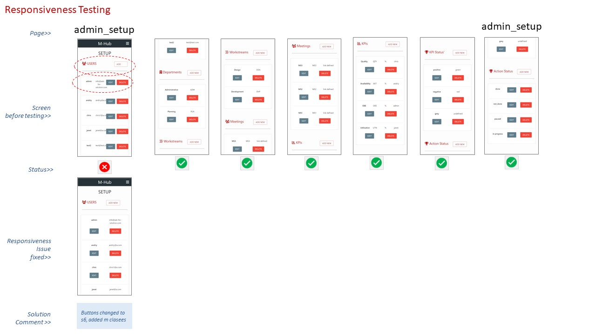
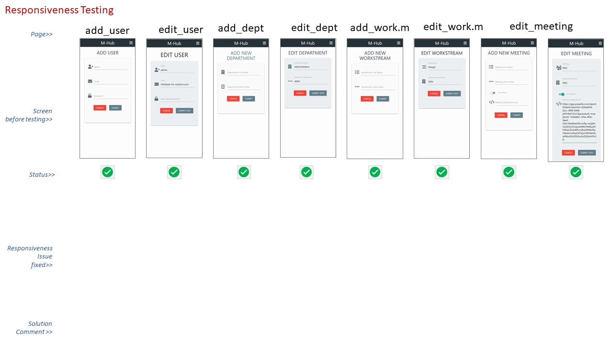
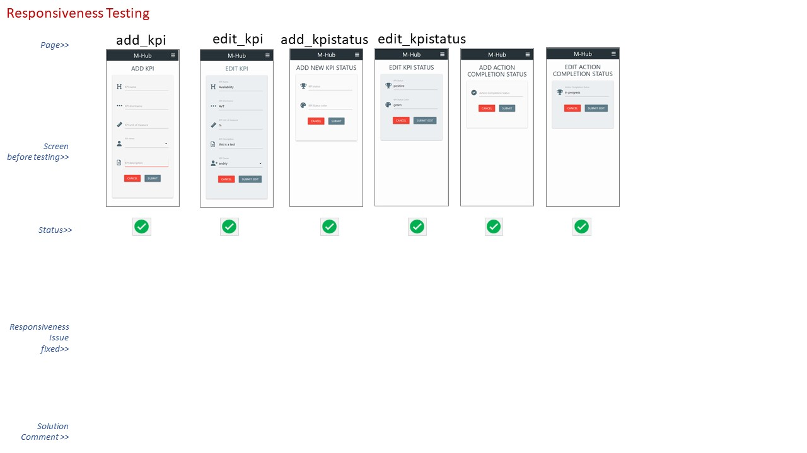
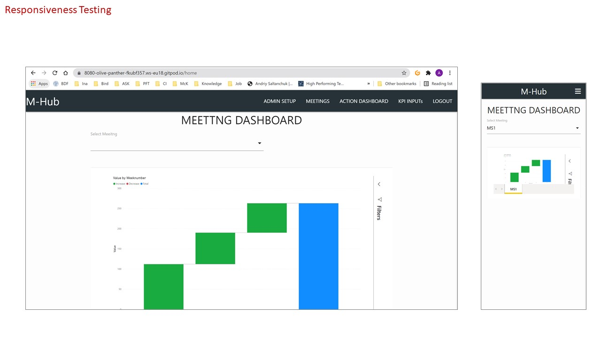
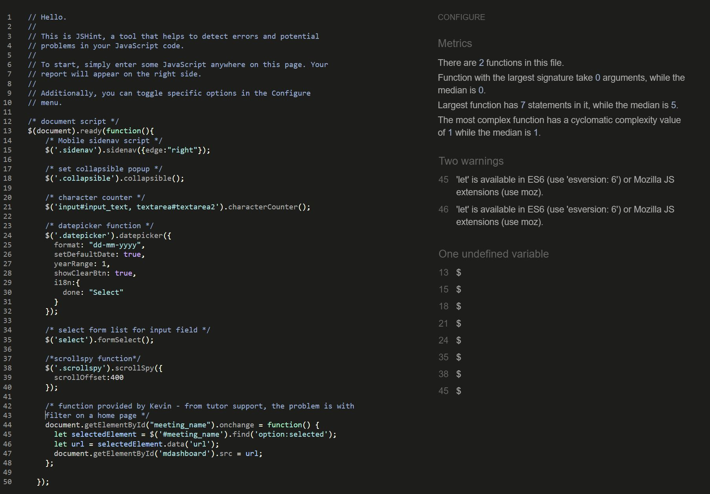

# TESTING MS3 PROJECT APPLICATION
## **1. Access and Security**
The direct access was tested using the app deployed to Heroku. I accessed each page typing in the template code. 
I tested 2 scenarios of direct acess' - 1) "Non-User direct access test",  and 2) "User to admin direct access test".
The access test received a "pass" if the application rendered a flash messsage: "Please, login to access the page" for 1st scenario and "Please, login *as Admin* to access the page" for the 2nd scenario.

### Table of functions/templates tested using 2 scenarios access testing and testing result
No. | Temolaete/Function        | Access Level  | Non-User direct access test  | User to admin direct access test
--  |--                         |--        |--      | --    
1   | login                     | non-user |   NA   |  NA
2   | register                  | non-user |   NA   |  NA
3   | user_dashboard            | user     | pass   | NA
4   | add_action                | user     | pass   | NA
5   | kpi_input                 | user     | pass   | NA
6   | edit_actionstatus         | user     | pass in firefox, id required   | NA
7   | copy_kpiinput             | user     | pass in firefox, id required   | NA
8   | home                      | Admin    | pass   | pass
9   | admin_setup               | Admin    | pass   | pass
10  | add_user                  | Admin    | pass   | pass
11  | add_department            | Admin    | pass   | pass
12  | add_workstream            | Admin    | pass   | pass
13  | add_meeting               | Admin    | pass   | pass
14  | add_kpi                   | Admin    | pass   | pass
15  | add_kpistatus             | Admin    | pass   | pass
16  | add_completionstatus      | Admin    | pass   | pass
17  | edit_user                 | Admin    | pass in firefox, id required | pass, id from firefox
18  | edit_department           | Admin    | pass in firefox, id required | pass, id from firefox
19  | edit_workstream           | Admin    | pass, id from firefox | pass, id from firefox
20  | edit_meeting              | Admin    | pass, id from firefox | pass, id from firefox
21  | edit_kpi                  | Admin    | pass, id from firefox | pass, id from firefox
22  | edit_kpistatus            | Admin    | pass, id from firefox | pass, id from firefox
23  | edit_completionstatus     | Admin    | pass, id from firefox | pass, id from firefox
24  | edit_kpiinput             | Admin    | pass, id from firefox | pass, id from firefox
25  | edit_action               | Admin    | pass, id from firefox | pass, id from firefox
## **2. Navigation**
## **3. Browser Compatibilty**
## **4. Responsiveness**
Responsiveness was tested for mobile device mainly. The most problematic page was "home" page thatcontained meeting dashboard with iframe conneceted to PowerBi. I resolved responsiveness issue following recommendations from https://www.w3schools.com/howto/tryit.asp?filename=tryhow_css_responsive_iframe_169. Below you can see the testing of all the templates in google chrom inspect using iPhone x resopnsiveness window. I have developed few pictures in powerpoint to demonstrate few problems that I resolved uing materiialise grid: 

### Picture 1: Login, register, KPI input, Individual dashboard and Add action page

### Picture 2: Forms Add/edit/copy kpiinput

### Picture 3: Admin setup page

### Picture 4: add/edit forms for user, dept, workstream, meeting, actionstatus

### Picture 5:kpi, kpistatus, 

### Picture 6: Meeting Dashboard with iframe

## **5. User stories testing**
## **6. Code validation**
### **[HTML](https://validator.w3.org/) and [CSS](https://jigsaw.w3.org/css-validator/)**
No. | code | result | bugs section refno| HTML validation | CSS validation
--  |--    |--      |-- |-- |--|
1   | base | 2 issues | 1,2 | [link](https://validator.w3.org/nu/?showsource=yes&showoutline=yes&useragent=Validator.nu%2FLV+http%3A%2F%2Fvalidator.w3.org%2Fservices&acceptlanguage=&doc=https%3A%2F%2Fask-pft-meetinghub.herokuapp.com%2Fadmin_setup) | [css link](https://jigsaw.w3.org/css-validator/validator?uri=http%3A%2F%2Fask-pft-meetinghub.herokuapp.com%2Fregister&profile=css3svg&usermedium=all&warning=1&vextwarning=&lang=en#errors)
2   | register | same as p1 | 1,2 |[link](https://validator.w3.org/nu/?showsource=yes&showoutline=yes&useragent=Validator.nu%2FLV+http%3A%2F%2Fvalidator.w3.org%2Fservices&acceptlanguage=&doc=https%3A%2F%2Fask-pft-meetinghub.herokuapp.com%2Fregister) | [css link](https://jigsaw.w3.org/css-validator/validator?uri=http%3A%2F%2Fask-pft-meetinghub.herokuapp.com%2Fregister&profile=css3svg&usermedium=all&warning=1&vextwarning=&lang=en#errors)
3   | login | same as p1 | 1 | [link](https://validator.w3.org/nu/?showsource=yes&showoutline=yes&useragent=Validator.nu%2FLV+http%3A%2F%2Fvalidator.w3.org%2Fservices&acceptlanguage=&doc=https%3A%2F%2Fask-pft-meetinghub.herokuapp.com%2Flogin) | same as 2
4   | setup | same as p1 | 1 | [link](https://validator.w3.org/nu/?showsource=yes&showoutline=yes&useragent=Validator.nu%2FLV+http%3A%2F%2Fvalidator.w3.org%2Fservices&acceptlanguage=&doc=https%3A%2F%2Fask-pft-meetinghub.herokuapp.com%2Fadmin_setup) | same as 2
5   | home | same as p1 | 1 | [link](https://validator.w3.org/nu/?showsource=yes&showoutline=yes&useragent=Validator.nu%2FLV+http%3A%2F%2Fvalidator.w3.org%2Fservices&acceptlanguage=&doc=https%3A%2F%2Fask-pft-meetinghub.herokuapp.com%2Fadmin_setup)| [css link](https://jigsaw.w3.org/css-validator/validator?uri=https%3A%2F%2Fask-pft-meetinghub.herokuapp.com%2Fhome&profile=css3svg&usermedium=all&warning=1&vextwarning=&lang=en)
6   | user_dashboard/admin | same as p1 | 1, 3| [link](https://jigsaw.w3.org/css-validator/validator?uri=http%3A%2F%2Fask-pft-meetinghub.herokuapp.com%2Fuser_dashboard%2Fadmin&profile=css3svg&usermedium=all&warning=1&vextwarning=&lang=en) | same as 2
8   | kpi_input | same as p1 | 1 | [link](https://validator.w3.org/nu/?showsource=yes&showoutline=yes&showimagereport=yes&doc=https%3A%2F%2Fask-pft-meetinghub.herokuapp.com%2Fkpi_input#l22c20) | same as 2
9   | add_action |same as p1 | 1 | [link](https://validator.w3.org/nu/?showsource=yes&showoutline=yes&showimagereport=yes&doc=https%3A%2F%2Fask-pft-meetinghub.herokuapp.com%2Fadd_action#l22c20) | same as 2
11   | add_completionstatus | same as p1 | 1 | [link](https://validator.w3.org/nu/?showsource=yes&showoutline=yes&showimagereport=yes&doc=https%3A%2F%2Fask-pft-meetinghub.herokuapp.com%2Fadd_completionstatus#l22c20) | same as 2
12   | add_department | same as p1 | 1 | [link](https://validator.w3.org/nu/?showsource=yes&showoutline=yes&showimagereport=yes&doc=https%3A%2F%2Fask-pft-meetinghub.herokuapp.com%2Fadd_department#l22c20) | same as 2
13   | add_kpi | same as p1 | 1 | [link](https://validator.w3.org/nu/?showsource=yes&showoutline=yes&showimagereport=yes&doc=https%3A%2F%2Fask-pft-meetinghub.herokuapp.com%2Fadd_kpi#l22c20) | same as 2
14   | add_kpiinput | same as p1 | 1 | [link](https://validator.w3.org/nu/?showsource=yes&showoutline=yes&showimagereport=yes&doc=https%3A%2F%2Fask-pft-meetinghub.herokuapp.com%2Fadd_kpiinput#l22c20) | same as 2
15   | add_kpistatus | same as p1 | 1 | [link](https://validator.w3.org/nu/?showsource=yes&showoutline=yes&showimagereport=yes&doc=https%3A%2F%2Fask-pft-meetinghub.herokuapp.com%2Fadd_kpistatus#l22c20) | same as 2
16   | add_meeting | same as p1 | 1 | [link](https://validator.w3.org/nu/?showsource=yes&showoutline=yes&showimagereport=yes&doc=https%3A%2F%2Fask-pft-meetinghub.herokuapp.com%2Fadd_meeting#l22c20) | same as 2
17   | add_user | same as p1 | 1 | [link](https://validator.w3.org/nu/?showsource=yes&showoutline=yes&showimagereport=yes&doc=https%3A%2F%2Fask-pft-meetinghub.herokuapp.com%2Fadd_user#l22c20) | same as 2
18   | add_workstream | same as p1 | 1 | [link](https://validator.w3.org/nu/?showsource=yes&showoutline=yes&showimagereport=yes&doc=https%3A%2F%2Fask-pft-meetinghub.herokuapp.com%2Fadd_workstream#l22c20) | same as 2
19   | copy_kpiiinput | same as p1 | 1 | [link](https://validator.w3.org/nu/?showsource=yes&showoutline=yes&showimagereport=yes&doc=https%3A%2F%2Fask-pft-meetinghub.herokuapp.com%2Fcopy_kpiinput%2F6192a7be008e8cebc2ef2e91#l22c20) | same as 2
20   | edit_action | same as p1 | 1 | [link](https://validator.w3.org/nu/?showsource=yes&showoutline=yes&showimagereport=yes&doc=https%3A%2F%2Fask-pft-meetinghub.herokuapp.com%2Fedit_action%2F618e8406d11bd6cea0db9c82#l22c20) | same as 2
21*   | edit_actionstatus | same as p1 | 1 | [link](https://validator.w3.org/nu/?showsource=yes&showoutline=yes&doc=http%3A%2F%2Fask-pft-meetinghub.herokuapp.com%2Fedit_actionstatus%2F618e87d38d0fd6bca9b0cba2) | same as 2
22   | edit_completionstatus | same as p1 | 1 | [link](https://validator.w3.org/nu/?showsource=yes&showoutline=yes&showimagereport=yes&doc=https%3A%2F%2Fask-pft-meetinghub.herokuapp.com%2Fedit_completionstatus%2F618196a459f4c915096d9a6b#l22c20) | same as 2
23   | edit_department | same as p1 | 1 | [link](https://validator.w3.org/nu/?showsource=yes&showoutline=yes&showimagereport=yes&doc=https%3A%2F%2Fask-pft-meetinghub.herokuapp.com%2Fedit_department%2F618292e3283d8d48d282384b#l22c20) | same as 2
24   | edit_kpi | same as p1 | 1 | [link](https://validator.w3.org/nu/?showsource=yes&showoutline=yes&showimagereport=yes&doc=https%3A%2F%2Fask-pft-meetinghub.herokuapp.com%2Fedit_kpi%2F618db1bfb54e6dae111c57d8#l22c20) | same as 2
25  | edit_kpiinput | same as p1 | 1 | [link](https://validator.w3.org/nu/?showsource=yes&showoutline=yes&showimagereport=yes&doc=https%3A%2F%2Fask-pft-meetinghub.herokuapp.com%2Fedit_kpiinput%2F6192a7be008e8cebc2ef2e91#l22c20) | same as 2
26  | edit_kpistatus | same as p1 | 1 | [link](https://validator.w3.org/nu/?showsource=yes&showoutline=yes&showimagereport=yes&doc=https%3A%2F%2Fask-pft-meetinghub.herokuapp.com%2Fedit_kpistatus%2F61830013e1194be16710643e#l22c20) | same as 2
27  | edit_meeting | same as p1 | 1 | [link](https://validator.w3.org/nu/?showsource=yes&showoutline=yes&showimagereport=yes&doc=https%3A%2F%2Fask-pft-meetinghub.herokuapp.com%2Fedit_meeting%2F6187b8b0c09f87e5f2443cd4#l22c20) | same as 2
28  | edit_user | same as p1 | 1 | [link](https://validator.w3.org/nu/?showsource=yes&showoutline=yes&showimagereport=yes&doc=https%3A%2F%2Fask-pft-meetinghub.herokuapp.com%2Fedit_user%2F6182d3b16e916b0fb4b8fac9#l22c20) | same as 2
29  | edit_workstream | same as p1 | 1 | [link](https://validator.w3.org/nu/?showsource=yes&showoutline=yes&showimagereport=yes&doc=https%3A%2F%2Fask-pft-meetinghub.herokuapp.com%2Fedit_workstream%2F6187b5b5ddb6ab726c8e6cf3#l22c20) | same as 2

### **[JavaScript](https://jshint.com/)**

to fix that I had to go to gitpod settings and add json setting to enable esversion6 as recommended by r3media on youtube: https://www.youtube.com/watch?v=QDzeU1FUZRk&ab_channel=R3HABMEDIA. 
Instead I just deleted let, defining variables in a simpler way without let way.
## **6. Site Performance testing**
* Lighthoouse for Site Performance

## **Bugs:**
#
* Issue 1: HTML validation, base template has 2 issues, 1 with section heading, 1 with h font. No visible impat on the page
* Solution: Fixed font format
* Result: HTML warning error disappear.
#
* Issue 2: register css validation - error on line 5, 11, 20
* Solution: 
    * line 5 - it was testing css, remove body color
    * line 11 - add "text-shadow:"
    * line 20 - removed comma
* Result: No impact on on html noticed
#
* Issue 3: css validation user_dashboard  - error on line 5, 13, typose in the code
* Solution: 
    * line 5 typo - text-shadow: 2px 2px 2px rgba(0,0,0,0.5)
    * line 13 - border:solid 0.1px; - added px unit 
* Result: No impact on on html noticed
#
* Issue 4:JS Hint warned me about esversion6 on,lines 45, 46
* Solution: deleted let
* Result: warnings disappear