# TESTING MS3 PROJECT APPLICATION
## **1. Access and Security**
The direct access was tested using the app deployed to Heroku. I accessed each page typing in the template code. 
I tested 2 scenarios of direct acess' - 1) "Non-User direct access test",  and 2) "User to admin direct access test".
The access test received a "pass" if the application rendered a flash messsage: "Please, login to access the page" for 1st scenario and "Please, login *as Admin* to access the page" for the 2nd scenario.

### Table of functions/templates tested using 2 scenarios access testing and testing result
No. | Temolaete/Function        | Access Level  | Non-User direct access test  | User to admin direct access test
--  |--                         |--        |--      | --    
1   | login                     | non-user |   NA   |  NA
2   | register                  | non-user |   NA   |  NA
3   | user_dashboard            | user     | pass   | NA
4   | add_action                | user     | pass   | NA
5   | kpi_input                 | user     | pass   | NA
6   | edit_actionstatus         | user     | pass in firefox, id required   | NA
7   | copy_kpiinput             | user     | pass in firefox, id required   | NA
8   | home                      | Admin    | pass   | pass
9   | admin_setup               | Admin    | pass   | pass
10  | add_user                  | Admin    | pass   | pass
11  | add_department            | Admin    | pass   | pass
12  | add_workstream            | Admin    | pass   | pass
13  | add_meeting               | Admin    | pass   | pass
14  | add_kpi                   | Admin    | pass   | pass
15  | add_kpistatus             | Admin    | pass   | pass
16  | add_completionstatus      | Admin    | pass   | pass
17  | edit_user                 | Admin    | pass in firefox, id required | pass, id from firefox
18  | edit_department           | Admin    | pass in firefox, id required | pass, id from firefox
19  | edit_workstream           | Admin    | pass, id from firefox | pass, id from firefox
20  | edit_meeting              | Admin    | pass, id from firefox | pass, id from firefox
21  | edit_kpi                  | Admin    | pass, id from firefox | pass, id from firefox
22  | edit_kpistatus            | Admin    | pass, id from firefox | pass, id from firefox
23  | edit_completionstatus     | Admin    | pass, id from firefox | pass, id from firefox
24  | edit_kpiinput             | Admin    | pass, id from firefox | pass, id from firefox
25  | edit_action               | Admin    | pass, id from firefox | pass, id from firefox
#
## **2.Navigation in different browsers**
All the buttons and links for admina nd user were tested at least once in 3 different browsers on PC Macbook Pro with Windows installed on it. Major focus was on CRUD functionality for each of 10 collections.

The teable below shows the test for application 137 navigation features:
No | admin/user | page          | button / link             | Google    | FireFox   | Safari
--|--           |--             |--                         |--         |--         |--
1 | no          |login          |    register  link         |pass       |   pass        |pass
2 | no          |login          |    register  navbar link  |pass       |   pass        |pass
3 | no          |login          |    login button           |pass       |   pass        |pass
4 | no          |login          |    login  link            |pass       |   pass        |pass
5 | no          |register       |    login  navbar link     |pass       |   pass        |pass
6 | no          |register       |    login  button admin    |pass       |   pass        |pass
7 | no          |register       |    login  user admin      |pass       |   pass        |pass
8 | admin       |user_dashboard |    navbar meetings link   |pass       |   pass        |pass
9 | admin       |user_dashboard |    navbar admin setup link|pass       |   pass        |pass
10 | admin       |user_dashboard |    navbar action dashboard link|  pass|  pass         |pass
11 | admin       |user_dashboard |    navbar kpi inputs link |  pass     |  pass         |pass
12 | admin       |user_dashboard |    navbar kpi inputs link |  pass     |  pass         |pass
13 | admin       |user_dashboard |    add action button      |  pass     |  pass         |pass
14 | admin       |user_dashboard |    edit action button     |  pass     |  pass         |pass
15 | admin       |user_dashboard |   filter select and button|  pass     |  pass         |pass
16 | admin       |user_dashboard |    filter refresh button  |  pass     |  pass         |pass
17 | admin       |user_dashboard |    action edit button     |  pass     |  pass         |pass
18 | admin       |user_dashboard |    action edit button     |  pass     |  pass         |pass
19 | admin       |user_dashboard |    kpi input button       |  pass     |  pass         |pass
20 | admin       |user_dashboard |    new action for red KPI |  pass     |  pass         |pass
21 | admin       |kpi_input      |    add input button       |  pass     |  pass         |pass
22 | admin       |kpi_input      |    search field KPIname   |  pass     |  pass         |pass
23 | admin       |kpi_input      |   search field week number|  pass     |  pass         |pass
24 | admin       |kpi_input      |    search field KPi owner |  pass     |  pass         |pass
25 | admin       |kpi_input      |    search field status    |  pass     |  pass         |pass
26 | admin       |kpi_input      |search field refresh button|  pass     |  pass         |pass
27 | admin       |kpi_input      |  clone button             |  pass     |  pass         |pass
28 | admin       |kpi_input      |  edit button              |  pass     |  pass         |pass
29 | admin       |admin_setup    |  spy scroll (PC)          |  pass     |  pass         |pass
30 | admin       |admin_setup    |  add user button          |  pass     |  pass         |pass
31 | admin       |admin_setup    |  edit user button         |  pass     |  pass         |pass
32 | admin       |admin_setup    |  delete user button       |  pass     |  pass         |pass
33 | admin       |admin_setup    |  add department button    |  pass     |  pass         |pass
34 | admin       |admin_setup    |  edit department button   |  pass     |  pass         |pass
35 | admin       |admin_setup    |  delete department button |  pass     |  pass         |pass
36 | admin       |admin_setup    |  add workstream button    |  pass     |  pass         |pass
37 | admin       |admin_setup    |  edit workstream button   |  pass     |  pass         |pass
38 | admin       |admin_setup    |  delete workstream button |  pass     |  pass         |pass
39 | admin       |admin_setup    |  add meeting button       |  pass     |  pass         |pass
40 | admin       |admin_setup    |  edit meeting button      |  pass     |  pass         |pass
41 | admin       |admin_setup    |  delete meeting button    |  pass     |  pass         |pass
44 | admin       |admin_setup    |  add kpi button           |  pass     |  pass         |pass
45 | admin       |admin_setup    |  edit kpi button          |  pass     |  pass         |pass
46 | admin       |admin_setup    |  delete kpi button        |  pass     |  pass         |pass
47 | admin       |admin_setup    |  add kpi status button    |  pass     |  pass         |pass
48 | admin       |admin_setup    |  edit kpi status button   |  pass     |  pass         |pass
49 | admin       |admin_setup    |  delete kpi status button |  pass     |  pass         |pass
50 | admin       |admin_setup    |  add action status button |  pass     |  pass         |pass
51 | admin       |admin_setup    |  edit action status button|  pass     |  pass         |pass
52 | admin       |admin_setup    |  delete action status button  |  pass |  pass         |pass
53 | admin       |meetings       |  filter MS1 to activate PBI link|  pass|   pass       |pass
54 | admin       |meetings       |  filter MS2 to activate PBI link|  pass|   pass       |pass
55 | admin       |meetings       |  filter MS3 to activate PBI link|  pass|   pass       |pass
56 | admin       |logout         |  navbar link                    |  pass     |   pass  |pass
57 | admin       |add_input      |  submit button            |  pass     |   pass        |pass
58 | admin       |add_input      |  cancel button            |  pass     |   pass        |pass
59 | admin       |add_input      |  automatic logdate and weeknumber|  pass     |   pass |pass
60 | admin       |add_input      |  select elements (name, owner, status)|  pass|   pass |pass
61 | admin       |add_input      |  datepicker (logdate)     |  pass     |  pass         |pass
62 | admin       |edit_input     |  submit button            |  pass     |  pass         |pass
63 | admin       |edit_input     |  cancel button            |  pass     |  pass         |pass
64 | admin       |edit_input     |  delete button            |  pass     |  pass         |pass
65 | admin       |edit_input     |  automatic logdate and weeknumber|  pass     |   pass |pass
66 | admin       |edit_input     |  select elements (name, owner, status)|  pass|  pass  |pass
67 | admin       |edit_input     |  datepicker (logdate)     |  pass     |  pass         |pass
68 | admin       |copy_input     |  input fields pre-filled  |  pass     |  pass         |pass
69 | admin       |copy_input     |  select elements (name, owner, status)|  pass|   pass |pass
70 | admin       |copy_input     |  datepicker               |  pass     |  pass         |pass
71 | admin       |copy_input     |  submit button            |  pass     |  pass         |pass
72 | admin       |copy_input     |  cancel button            |  pass     |  pass         |pass
73 | admin       |add_user       |  cancel button            |  pass     |  pass         |pass
74 | admin       |add_user       |  submit button            |  pass     |  pass         |pass
75 | admin       |edit_user       | input fields pre-filled  |  pass     |  pass         |pass
76 | admin       |edit_user       | cancel button            |  pass     |  pass         |pass
77 | admin       |edit_user       | submit button            |  pass     |  pass         |pass
78 | admin       |add_dept               |  cancel button    |  pass     |  pass         |pass
79 | admin       |add_dept               |  submit button    |  pass     |  pass         |pass
80 | admin       |edit_dept              | input fields pre-filled|  pass     |   pass   |pass
81 | admin       |edit_dept              | cancel button            |  pass     | pass   |pass
82 | admin       |edit_dept              | submit button            |  pass     | pass   |pass
83 | admin       |add_workstream         |  cancel button            |  pass     |   pass|pass
84 | admin       |add_workstream         |  submit button            |  pass     |   pass|pass
85 | admin       |edit_workstream        | input fields pre-filled  |  pass     |    pass|pass
86 | admin       |edit_workstream        | cancel button            |  pass     |    pass|pass
87 | admin       |edit_workstream        | submit button            |  pass     |    pass|pass
88 | admin       |add_meeting            |  cancel button           |  pass     |    pass      |pass
89 | admin       |add_meeting            |  submit button           |  pass     |    pass      |pass
90 | admin       |edit_meeting           | input fields pre-filled  |  pass     |    pass      |pass
91 | admin       |edit_meeting           | switch                   |  pass     |    pass      |pass
92 | admin       |edit_meeting           | cancel button            |  pass     |    pass      |pass
93 | admin       |edit_meeting           | submit button            |  pass     |   pass       |pass
94 | admin       |add_kpi                |  cancel button            |  pass     |  pass         |pass
95 | admin       |add_kpi                |  submit button            |  pass     |  pass         |pass
96 | admin       |add_kpi                |  dropdown (owner)         |  pass     |   pass        |pass
97 | admin       |edit_kpi               | input fields pre-filled   |  pass     |  pass        |pass
98 | admin       |edit_kpi               | cancel button             |  pass     |  pass        |pass
99 | admin       |edit_kpi                |  dropdown (owner)        |  pass     |   pass        |pass
100 | admin       |edit_kpi               | submit button             |  pass     |  pass        |pass
101 | admin       |add_kpistatus         |  cancel button            |  pass     |   pass        |pass
102 | admin       |add_kpistatus         |  submit button            |  pass     |   pass        |pass
103 | admin       |edit_kpistatus        | input fields pre-filled  |  pass     |    pass      |pass
104 | admin       |edit_kpistatus        | cancel button            |  pass     |    pass      |pass
105 | admin       |edit_kpistatus        | submit button            |  pass     |    pass      |pass
106 | admin       |add_completionstatus  |  cancel button            |  pass     |   pass        |pass
107 | admin       |add_completionstatus  |  submit button            |  pass     |   pass        |pass
108 | admin       |edit_completionstatus | input fields pre-filled  |  pass     |    pass      |pass
109 | admin       |edit_completionstatus | cancel button            |  pass     |    pass      |pass
110 | admin       |edit_completionstatus | submit button            |  pass     |   pass       |pass
111 | user        |user_dashboard |    navbar action dashboard link|  pass|    pass       |pass
112 | user        |user_dashboard |    navbar kpi inputs link |  pass     |    pass       |pass
113 | user        |logout         |    navbar link            |  pass     |    pass       |pass
114 | user        |user_dashboard |    add action button      |  pass     |    pass       |pass
115 | user        |user_dashboard |   filter select + button  |  pass     |    pass       |pass
116 | user        |user_dashboard |    filter refresh button  |  pass     |    pass       |pass
117 | user        |user_dashboard |    change status button   |  pass     |    pass       |pass
118 | user        |user_dashboard |    kpi input button       |  pass     |    pass       |pass
119 | user        |user_dashboard |    new action for red KPI |  pass     |    pass       |pass
120 | user        |kpi_input      |    add input button       |  pass     |    pass       |pass
121 | user        |kpi_input      |   search field week number|  pass     |    pass       |pass
122 | user        |kpi_input      |    search KPI status      |  pass     |    pass       |pass
123 | user        |kpi_input      |search field refresh button|  pass     |    pass       |pass
124 | user        |kpi_input      |  clone button             |  pass     |    pass       |pass
125 | user        |add_input      |  cancel button            |  pass     |    pass       |pass
126 | user        |add_input      |  submit button            |  pass     |    pass       |pass
127 | user        |add_input      |  automatic logdate and weeknumber|  pass     |  pass  |pass
128 | user        |add_input      |  select elements (name, owner, status)|  pass|  pass  |pass
129 | user        |add_input      |  datepicker (logdate)     |  pass     |  pass         |pass
130 | user        |copy_input     |  input fields pre-filled  |  pass     |  pass         |pass
131 | user        |copy_input     |  select elements (name, owner, status)|  pass | pass  |pass
132 | user        |copy_input     |  datepicker               |  pass     |  pass         |pass
133 | user        |copy_input     |  submit button            |  pass     |  pass         |pass
134 | user        |copy_input     |  cancel button            |  pass     |  pass         |pass
135 | user        |login          |  error if login with wrong paswword   |  pass|  pass  |pass
136 | user        |register       |  error if name with wrong email |  pass     |     pass|pass
137 | user        |register       |  error if wrong anme with right email |  pass|   pass |pass

While testing I noticed that KPI Summary on a Action Dashboard page does not have owner. Absence of this feature impacted intuitive navigation, so I added one ore column for the table showing each KPI owner on KPI Summary. It is important that if regular user logs in this table is filtered automatically to list only those KPIs that are assigned to this particular user. It was tested as well both for actioons and for KPI inputs.
During navigation testing I also tested if KPI summary is updated with latest KPI data input. It was also confirmed. Iteresting to note that users needs to be set up from the very befinning, if admin reassign the KPI owner on the KPI set up form, KPI summary table indicate empty fields and prompts the user to update the input by showing a button "INPUT" in KPI summary table for each empty KPI with status "undifined". 
This functionality was also tested. 
#
## **3. Browser Compatibilty**
3 browsers showed absolutely identical rendering of all the pages during navigation testing, here are couple of screenshots form Google Chrome, Firefox and Safari:
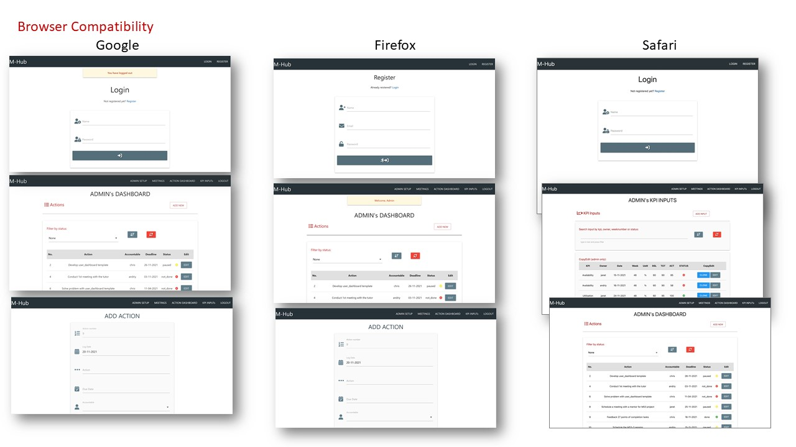
#
## **4. Responsiveness**
Responsiveness was tested for mobile device mainly. The most problematic page was "home" page thatcontained meeting dashboard with iframe conneceted to PowerBi. I resolved responsiveness issue following recommendations from https://www.w3schools.com/howto/tryit.asp?filename=tryhow_css_responsive_iframe_169. Below you can see the testing of all the templates in google chrom inspect using iPhone x resopnsiveness window. I have developed few pictures in powerpoint to demonstrate few problems that I resolved uing materiialise grid: 
#
### Picture 1: Login, register, KPI input, Individual dashboard and Add action page

#
### Picture 2: Forms Add/edit/copy kpiinput

#
### Picture 3: Admin setup page

#
### Picture 4: add/edit forms for user, dept, workstream, meeting, actionstatus

#
### Picture 5:kpi, kpistatus, 

#
### Picture 6: Meeting Dashboard with iframe

#
## **5. User stories testing**
User stories are shown on the pictures below:
Pic 7: DEVELOPER STORY 1: Developer can use an app to show how the software development skils can add value to consulting skills.
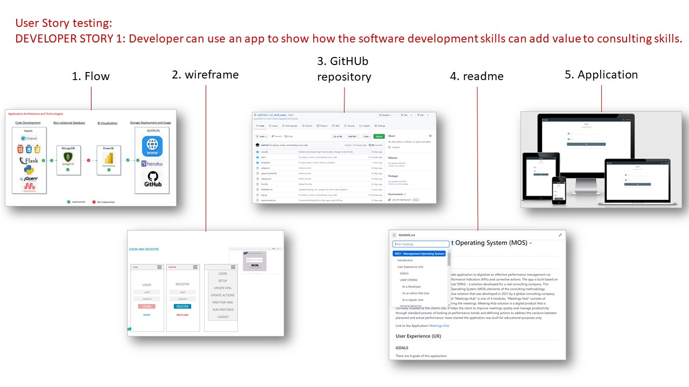
#
Pic 8: ADMIN STORY 2: The admin user registers with super admin rights - NOT IMPLEMENTED
#
Pic 9: ADMIN STORY 3: The admin user defines a system elements parameters: roles, participants, participants rights, meetings structure, meetings inputs parameters (KPIs and Actions), define accountability for teh KPIs and Atcions, edit actions and kpiinputs, define link to meeting dashboards
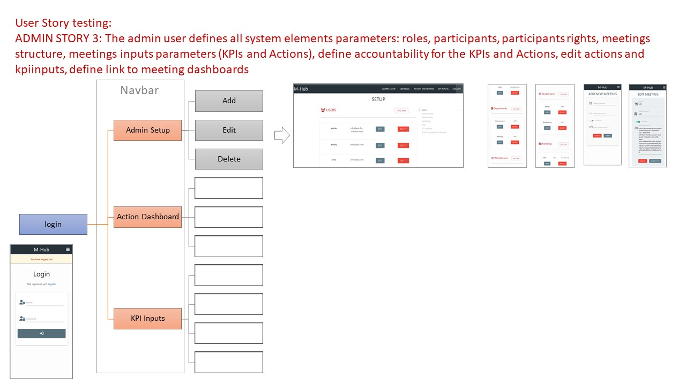
#
Pic 10: ADMIN STORY 4: The admin user prepares for the meeting prior to the meeting: edit/add KPIs inputs, update actions
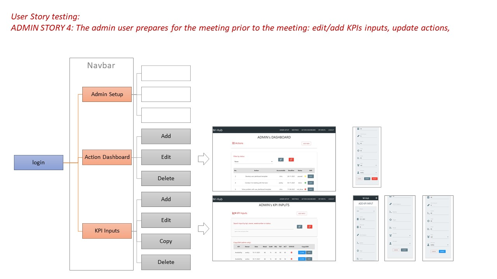
#
Pic 11: ADMIN STORY 5: The admin user enters new actions after each meeting based on results of the meeting
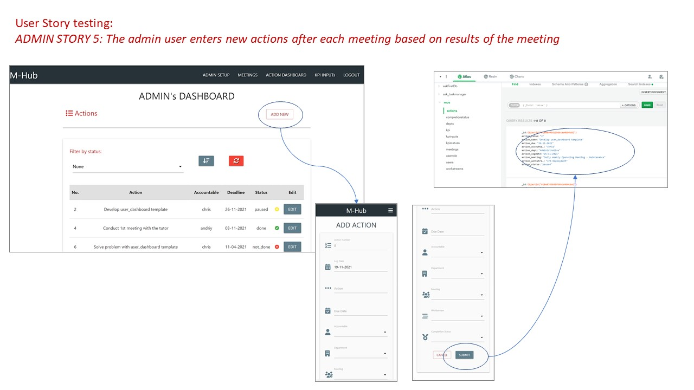
#
Pic 12: ADMIN STORY 6 : search actions by completion status, search kpi data inputs
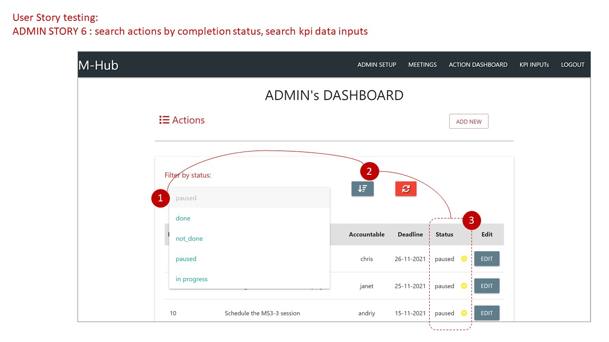
#
Pic 13: ADMIN STORY 7 : navigate through the navigation
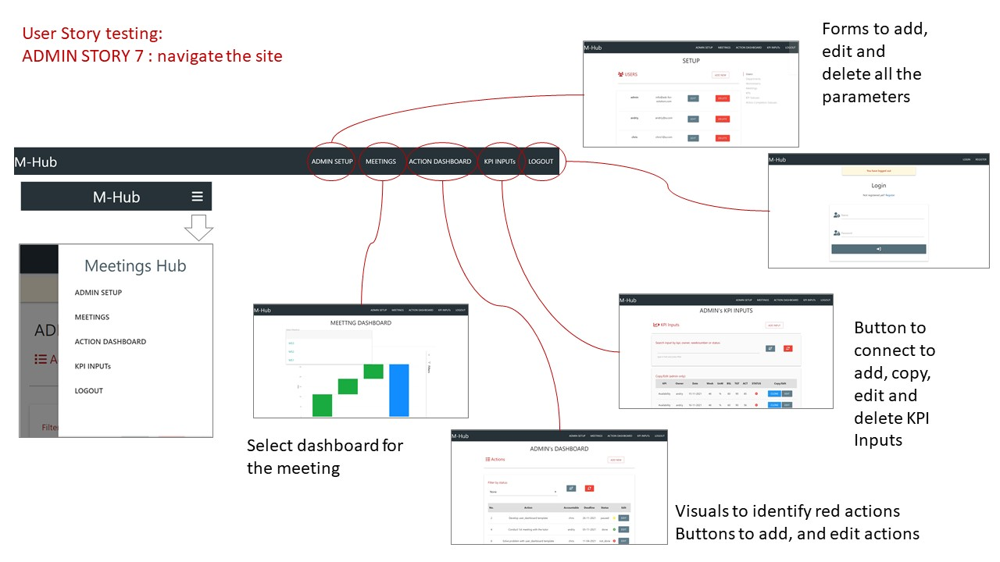
#
Pic 14: ADMIN STORY 8 : use mobile phone to execute the same functions as PC version
see responsive testing in section 4 of testing file.
#
Pic 15: USER STORY 9 : Check the status of curent actions, check if new actions are needed, update the status of existing actions
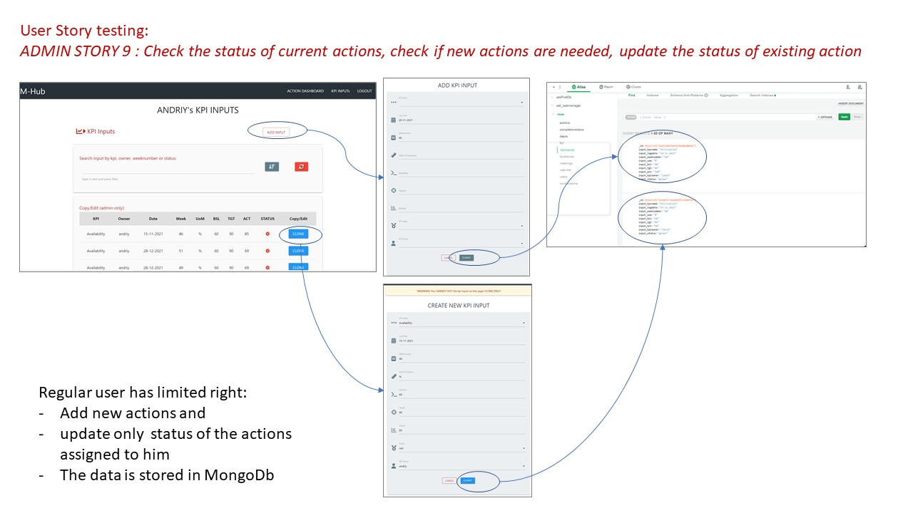
#
Pic 16: USER STORY 10 : add new kpi data inputs from blank form, add new kpis by copying them from existing kpis
Pic 17: USER STORY 11 : search actions by completion status, search kpi inputs by various parameters (name, week, status, owner)
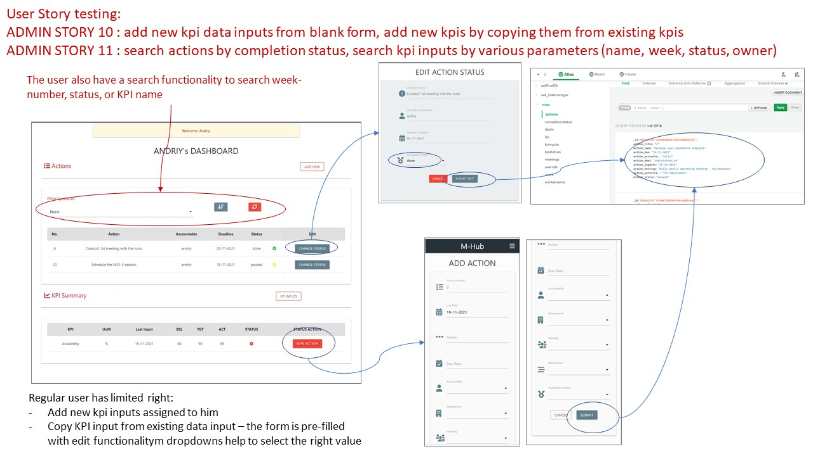
#
Pic 18: USER STORY 12: intuitively navigate through the pages (navbar and buttons)
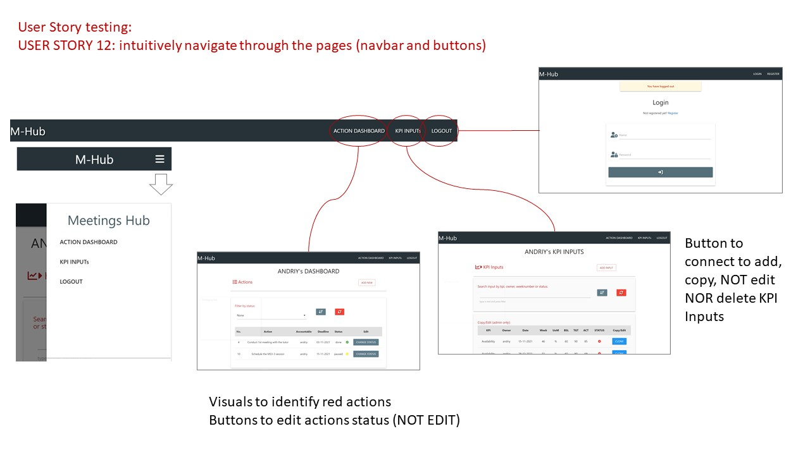
#
## **6. Code validation**
### **[HTML](https://validator.w3.org/) and [CSS](https://jigsaw.w3.org/css-validator/)**
No. | code | result | bugs section refno| HTML validation | CSS validation
--  |--    |--      |-- |-- |--|
1   | base | 2 issues | 1,2 | [link](https://validator.w3.org/nu/?showsource=yes&showoutline=yes&useragent=Validator.nu%2FLV+http%3A%2F%2Fvalidator.w3.org%2Fservices&acceptlanguage=&doc=https%3A%2F%2Fask-pft-meetinghub.herokuapp.com%2Fadmin_setup) | [css link](https://jigsaw.w3.org/css-validator/validator?uri=http%3A%2F%2Fask-pft-meetinghub.herokuapp.com%2Fregister&profile=css3svg&usermedium=all&warning=1&vextwarning=&lang=en#errors)
2   | register | same as p1 | 1,2 |[link](https://validator.w3.org/nu/?showsource=yes&showoutline=yes&useragent=Validator.nu%2FLV+http%3A%2F%2Fvalidator.w3.org%2Fservices&acceptlanguage=&doc=https%3A%2F%2Fask-pft-meetinghub.herokuapp.com%2Fregister) | [css link](https://jigsaw.w3.org/css-validator/validator?uri=http%3A%2F%2Fask-pft-meetinghub.herokuapp.com%2Fregister&profile=css3svg&usermedium=all&warning=1&vextwarning=&lang=en#errors)
3   | login | same as p1 | 1 | [link](https://validator.w3.org/nu/?showsource=yes&showoutline=yes&useragent=Validator.nu%2FLV+http%3A%2F%2Fvalidator.w3.org%2Fservices&acceptlanguage=&doc=https%3A%2F%2Fask-pft-meetinghub.herokuapp.com%2Flogin) | same as 2
4   | setup | same as p1 | 1 | [link](https://validator.w3.org/nu/?showsource=yes&showoutline=yes&useragent=Validator.nu%2FLV+http%3A%2F%2Fvalidator.w3.org%2Fservices&acceptlanguage=&doc=https%3A%2F%2Fask-pft-meetinghub.herokuapp.com%2Fadmin_setup) | same as 2
5   | home | same as p1 | 1 | [link](https://validator.w3.org/nu/?showsource=yes&showoutline=yes&useragent=Validator.nu%2FLV+http%3A%2F%2Fvalidator.w3.org%2Fservices&acceptlanguage=&doc=https%3A%2F%2Fask-pft-meetinghub.herokuapp.com%2Fadmin_setup)| [css link](https://jigsaw.w3.org/css-validator/validator?uri=https%3A%2F%2Fask-pft-meetinghub.herokuapp.com%2Fhome&profile=css3svg&usermedium=all&warning=1&vextwarning=&lang=en)
6   | user_dashboard/admin | same as p1 | 1, 3| [link](https://jigsaw.w3.org/css-validator/validator?uri=http%3A%2F%2Fask-pft-meetinghub.herokuapp.com%2Fuser_dashboard%2Fadmin&profile=css3svg&usermedium=all&warning=1&vextwarning=&lang=en) | same as 2
8   | kpi_input | same as p1 | 1 | [link](https://validator.w3.org/nu/?showsource=yes&showoutline=yes&showimagereport=yes&doc=https%3A%2F%2Fask-pft-meetinghub.herokuapp.com%2Fkpi_input#l22c20) | same as 2
9   | add_action |same as p1 | 1 | [link](https://validator.w3.org/nu/?showsource=yes&showoutline=yes&showimagereport=yes&doc=https%3A%2F%2Fask-pft-meetinghub.herokuapp.com%2Fadd_action#l22c20) | same as 2
11   | add_completionstatus | same as p1 | 1 | [link](https://validator.w3.org/nu/?showsource=yes&showoutline=yes&showimagereport=yes&doc=https%3A%2F%2Fask-pft-meetinghub.herokuapp.com%2Fadd_completionstatus#l22c20) | same as 2
12   | add_department | same as p1 | 1 | [link](https://validator.w3.org/nu/?showsource=yes&showoutline=yes&showimagereport=yes&doc=https%3A%2F%2Fask-pft-meetinghub.herokuapp.com%2Fadd_department#l22c20) | same as 2
13   | add_kpi | same as p1 | 1 | [link](https://validator.w3.org/nu/?showsource=yes&showoutline=yes&showimagereport=yes&doc=https%3A%2F%2Fask-pft-meetinghub.herokuapp.com%2Fadd_kpi#l22c20) | same as 2
14   | add_kpiinput | same as p1 | 1 | [link](https://validator.w3.org/nu/?showsource=yes&showoutline=yes&showimagereport=yes&doc=https%3A%2F%2Fask-pft-meetinghub.herokuapp.com%2Fadd_kpiinput#l22c20) | same as 2
15   | add_kpistatus | same as p1 | 1 | [link](https://validator.w3.org/nu/?showsource=yes&showoutline=yes&showimagereport=yes&doc=https%3A%2F%2Fask-pft-meetinghub.herokuapp.com%2Fadd_kpistatus#l22c20) | same as 2
16   | add_meeting | same as p1 | 1 | [link](https://validator.w3.org/nu/?showsource=yes&showoutline=yes&showimagereport=yes&doc=https%3A%2F%2Fask-pft-meetinghub.herokuapp.com%2Fadd_meeting#l22c20) | same as 2
17   | add_user | same as p1 | 1 | [link](https://validator.w3.org/nu/?showsource=yes&showoutline=yes&showimagereport=yes&doc=https%3A%2F%2Fask-pft-meetinghub.herokuapp.com%2Fadd_user#l22c20) | same as 2
18   | add_workstream | same as p1 | 1 | [link](https://validator.w3.org/nu/?showsource=yes&showoutline=yes&showimagereport=yes&doc=https%3A%2F%2Fask-pft-meetinghub.herokuapp.com%2Fadd_workstream#l22c20) | same as 2
19   | copy_kpiiinput | same as p1 | 1 | [link](https://validator.w3.org/nu/?showsource=yes&showoutline=yes&showimagereport=yes&doc=https%3A%2F%2Fask-pft-meetinghub.herokuapp.com%2Fcopy_kpiinput%2F6192a7be008e8cebc2ef2e91#l22c20) | same as 2
20   | edit_action | same as p1 | 1 | [link](https://validator.w3.org/nu/?showsource=yes&showoutline=yes&showimagereport=yes&doc=https%3A%2F%2Fask-pft-meetinghub.herokuapp.com%2Fedit_action%2F618e8406d11bd6cea0db9c82#l22c20) | same as 2
21*   | edit_actionstatus | same as p1 | 1 | [link](https://validator.w3.org/nu/?showsource=yes&showoutline=yes&doc=http%3A%2F%2Fask-pft-meetinghub.herokuapp.com%2Fedit_actionstatus%2F618e87d38d0fd6bca9b0cba2) | same as 2
22   | edit_completionstatus | same as p1 | 1 | [link](https://validator.w3.org/nu/?showsource=yes&showoutline=yes&showimagereport=yes&doc=https%3A%2F%2Fask-pft-meetinghub.herokuapp.com%2Fedit_completionstatus%2F618196a459f4c915096d9a6b#l22c20) | same as 2
23   | edit_department | same as p1 | 1 | [link](https://validator.w3.org/nu/?showsource=yes&showoutline=yes&showimagereport=yes&doc=https%3A%2F%2Fask-pft-meetinghub.herokuapp.com%2Fedit_department%2F618292e3283d8d48d282384b#l22c20) | same as 2
24   | edit_kpi | same as p1 | 1 | [link](https://validator.w3.org/nu/?showsource=yes&showoutline=yes&showimagereport=yes&doc=https%3A%2F%2Fask-pft-meetinghub.herokuapp.com%2Fedit_kpi%2F618db1bfb54e6dae111c57d8#l22c20) | same as 2
25  | edit_kpiinput | same as p1 | 1 | [link](https://validator.w3.org/nu/?showsource=yes&showoutline=yes&showimagereport=yes&doc=https%3A%2F%2Fask-pft-meetinghub.herokuapp.com%2Fedit_kpiinput%2F6192a7be008e8cebc2ef2e91#l22c20) | same as 2
26  | edit_kpistatus | same as p1 | 1 | [link](https://validator.w3.org/nu/?showsource=yes&showoutline=yes&showimagereport=yes&doc=https%3A%2F%2Fask-pft-meetinghub.herokuapp.com%2Fedit_kpistatus%2F61830013e1194be16710643e#l22c20) | same as 2
27  | edit_meeting | same as p1 | 1 | [link](https://validator.w3.org/nu/?showsource=yes&showoutline=yes&showimagereport=yes&doc=https%3A%2F%2Fask-pft-meetinghub.herokuapp.com%2Fedit_meeting%2F6187b8b0c09f87e5f2443cd4#l22c20) | same as 2
28  | edit_user | same as p1 | 1 | [link](https://validator.w3.org/nu/?showsource=yes&showoutline=yes&showimagereport=yes&doc=https%3A%2F%2Fask-pft-meetinghub.herokuapp.com%2Fedit_user%2F6182d3b16e916b0fb4b8fac9#l22c20) | same as 2
29  | edit_workstream | same as p1 | 1 | [link](https://validator.w3.org/nu/?showsource=yes&showoutline=yes&showimagereport=yes&doc=https%3A%2F%2Fask-pft-meetinghub.herokuapp.com%2Fedit_workstream%2F6187b5b5ddb6ab726c8e6cf3#l22c20) | same as 2

### **[JavaScript](https://jshint.com/)**

* to fix that I had to go to gitpod settings and add json setting to enable esversion6 as recommended by r3media on youtube: https://www.youtube.com/watch?v=QDzeU1FUZRk&ab_channel=R3HABMEDIA. 
* Instead I just deleted let, defining variables without let. It is also acceptable.

### **[Python](http://pep8online.com/checkresult)** - updated in January 2022
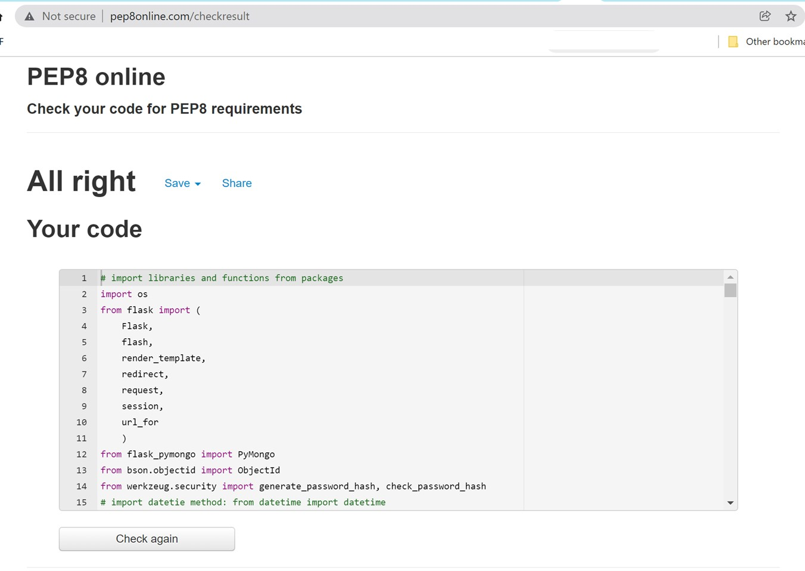

## **6. Site Performance testing**
* Lighthoouse for Site Performance

## **Bugs:**
#
* Issue 1: HTML validation, base template has 2 issues, 1 with section heading, 1 with h font. No visible impat on the page
* Solution: Fixed font format
* Result: HTML warning error disappear.
#
* Issue 2: register css validation - error on line 5, 11, 20
* Solution: 
    * line 5 - it was testing css, remove body color
    * line 11 - add "text-shadow:"
    * line 20 - removed comma
* Result: No impact on on html noticed
#
* Issue 3: css validation user_dashboard  - error on line 5, 13, typose in the code
* Solution: 
    * line 5 typo - text-shadow: 2px 2px 2px rgba(0,0,0,0.5)
    * line 13 - border:solid 0.1px; - added px unit 
* Result: No impact on on html noticed
#
* Issue 4:JS Hint warned me about esversion6 on,lines 45, 46
* Solution: deleted let
* Result: warnings disappear
#
* Issue 5: I did not know how to update certain fields without overwriting others, I knew the code but it did not work
* Solution: contacted Johan the tutor - he helped me with this code, I forgot to add parenthesis  for "$set": 
            
        mongo.db.kpi.update({"kpi_name": request.form.get("input_kpiname")},{"$set": latestinput})
* Result: fields are updated as I wanted - only those that I want to update - KPI collection