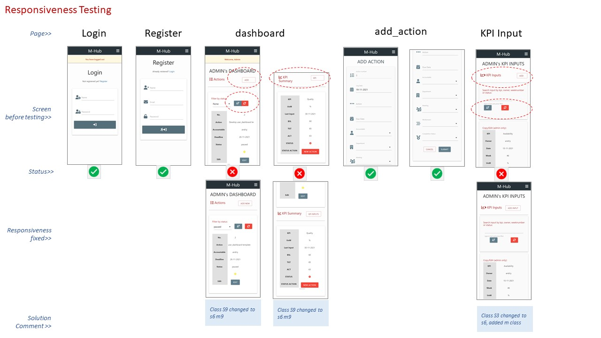

# TESTING MS3 PROJECT APPLICATION
## **1. Access and Security**
The direct access was tested using the app deployed to Heroku. I accessed each page typing in the template code. 
I tested 2 scenarios of direct acess' - 1) "Non-User direct access test",  and 2) "User to admin direct access test".
The access test received a "pass" if the application rendered a flash messsage: "Please, login to access the page" for 1st scenario and "Please, login *as Admin* to access the page" for the 2nd scenario.

### Table of functions/templates tested using 2 scenarios access testing and testing result
No. | Temolaete/Function        | Access Level  | Non-User direct access test  | User to admin direct access test
--  |--                         |--        |--      | --    
1   | login                     | non-user |   NA   |  NA
2   | register                  | non-user |   NA   |  NA
3   | user_dashboard            | user     | pass   | NA
4   | add_action                | user     | pass   | NA
5   | kpi_input                 | user     | pass   | NA
6   | edit_actionstatus         | user     | pass in firefox, id required   | NA
7   | copy_kpiinput             | user     | pass in firefox, id required   | NA
8   | home                      | Admin    | pass   | pass
9   | admin_setup               | Admin    | pass   | pass
10  | add_user                  | Admin    | pass   | pass
11  | add_department            | Admin    | pass   | pass
12  | add_workstream            | Admin    | pass   | pass
13  | add_meeting               | Admin    | pass   | pass
14  | add_kpi                   | Admin    | pass   | pass
15  | add_kpistatus             | Admin    | pass   | pass
16  | add_completionstatus      | Admin    | pass   | pass
17  | edit_user                 | Admin    | pass in firefox, id required | pass, id from firefox
18  | edit_department           | Admin    | pass in firefox, id required | pass, id from firefox
19  | edit_workstream           | Admin    | pass, id from firefox | pass, id from firefox
20  | edit_meeting              | Admin    | pass, id from firefox | pass, id from firefox
21  | edit_kpi                  | Admin    | pass, id from firefox | pass, id from firefox
22  | edit_kpistatus            | Admin    | pass, id from firefox | pass, id from firefox
23  | edit_completionstatus     | Admin    | pass, id from firefox | pass, id from firefox
24  | edit_kpiinput             | Admin    | pass, id from firefox | pass, id from firefox
25  | edit_action               | Admin    | pass, id from firefox | pass, id from firefox
## **2. Navigation**
## **3. Browser Compatibilty**
## **4. Responsiveness**
Responsiveness was tested for mobile device mainly. The most problematic page was "home" page thatcontained meeting dashboard with iframe conneceted to PowerBi. I resolved responsiveness issue following recommendations from https://www.w3schools.com/howto/tryit.asp?filename=tryhow_css_responsive_iframe_169. Below you can see the testing of all the templates in google chrom inspect using iPhone x resopnsiveness window. I have developed few pictures in powerpoint to demonstrate few problems that I resolved uing materiialise grid: 

### Picture 1: Login, register, KPI input, Individual dashboard and Add action page

### Picture 2: Forms Add/edit/copy kpiinput

### Picture 3: Admin setup page

### Picture 4: add/edit forms for user, dept, workstream, meeting, actionstatus

### Picture 5:kpi, kpistatus, 

### Picture 6: Meeting Dashboard with iframe

## **5. User stories testing**
## **8. Code validation**
### **[HTML](https://validator.w3.org/)**
No. | code | result | ref no to bugs section
--  |--    |--      |-- 
1   | base |
2   | register |
3   | login |
4   | setup |
5   | home |
6   | user_dashboard |
7   | register |
8   | kpi_input |
9   | add_action |
11   | add_completionstatus |
12   | add_department |
13   | add_kpi |
14   | add_kpiinput |
15   | add_kpistatus |
16   | add_meeting |
17   | add_user |
18   | add_workstream |
19   | copy_kpiiinput |
20   | edit_action |
21   | edit_actionstatus |
22   | edit_completionstatus |
23   | edit_department |
24   | edit_kpi |
25  | edit_kpiinput |
26  | edit_kpistatus |
27  | edit_meeting |
28  | edit_user |
29  | edit_workstream |

### **[CSS](https://jigsaw.w3.org/css-validator/)**
### **[JavaScript](https://jshint.com/)**

* 
* [Python]
* Lighthoouse for Site Performance

## Bugs:
* Issue 1:
* Solution:
* Result: